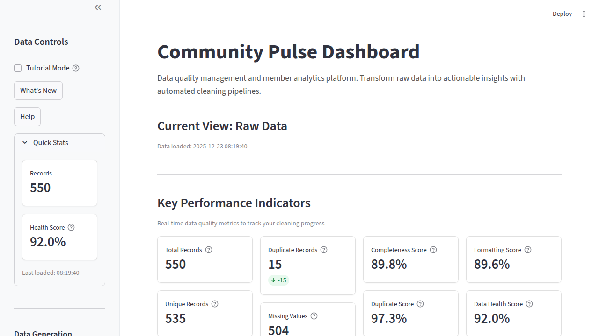
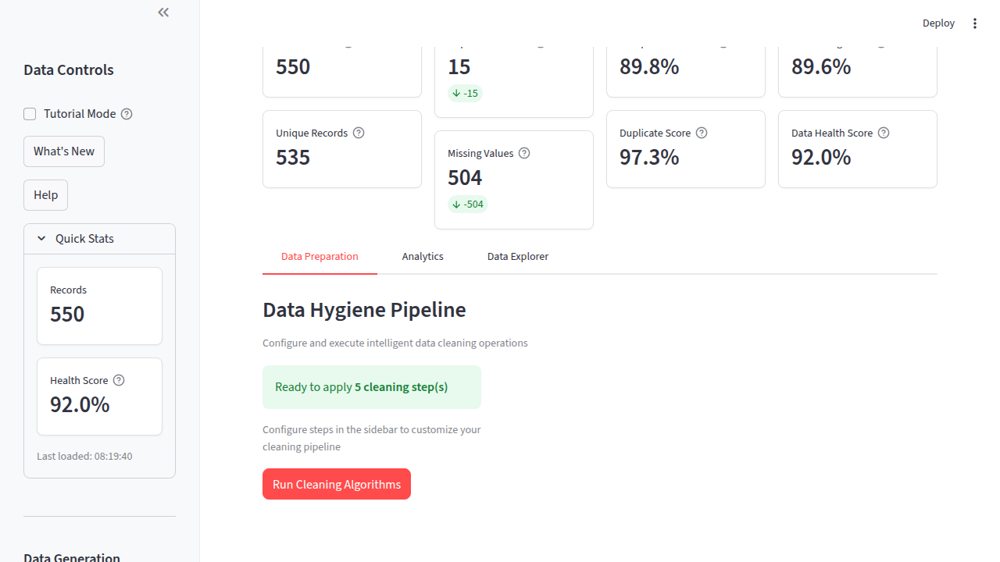
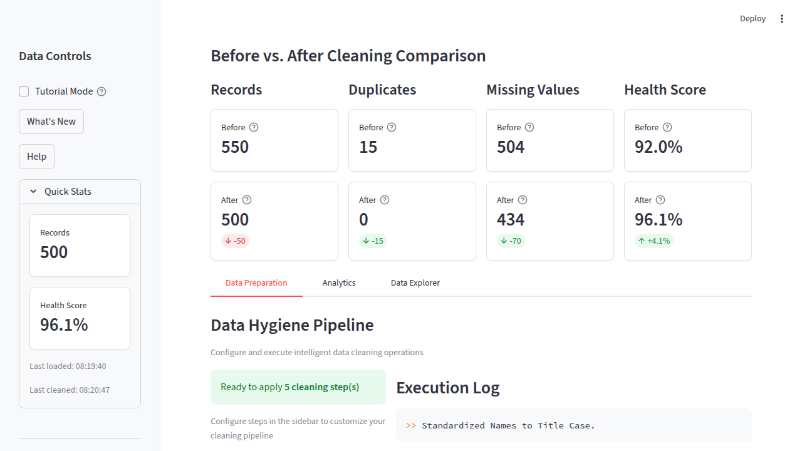
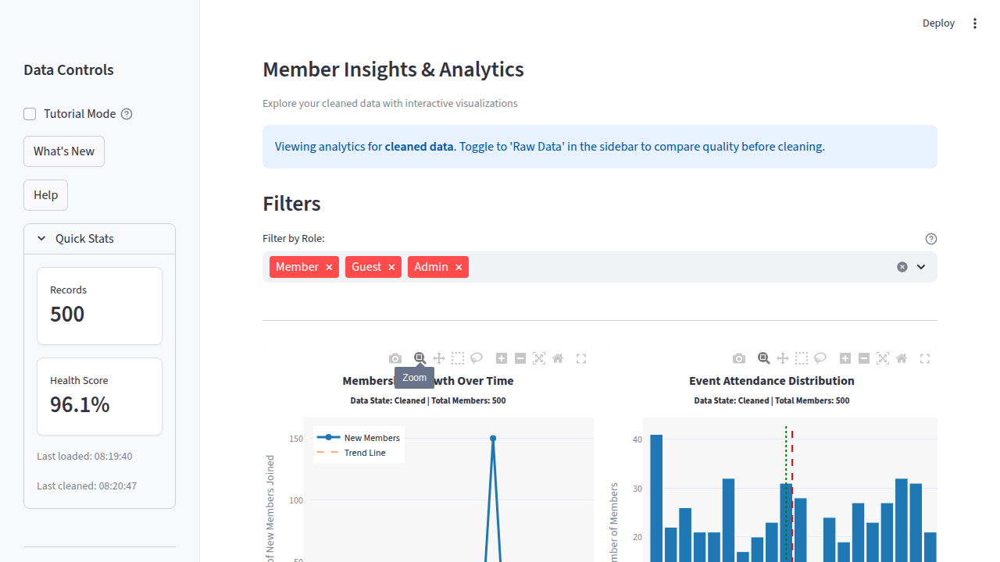

# Portfolio Showcase

**Community Pulse: Data Analytics Dashboard**

A comprehensive demonstration of production-ready software engineering, data analysis, and full-stack development skills.

---

## 🎯 Project Overview

**Live Demo:** [community-pulse.streamlit.app](https://community-pulse.streamlit.app/)  
**GitHub:** [github.com/hilliersmmain/community_pulse](https://github.com/hilliersmmain/community_pulse)  
**Tech Stack:** Python, Streamlit, Pandas, Plotly, Pytest

**What It Does:**  
Community Pulse is a production-ready data analytics dashboard that automatically cleans messy datasets and provides interactive visualizations to explore data quality improvements. It simulates real-world data quality problems found in CRM systems, spreadsheets, and legacy databases, then applies intelligent cleaning algorithms to transform raw data into analysis-ready datasets.

---

## 💡 Problem Statement

**Challenge:** How do you make data quality issues visible and fixable for non-technical users?

Real-world data is messy. Sales teams export CRMs with duplicates. Event organizers collect registrations with inconsistent formats. Data analysts spend 80% of their time cleaning data before analysis can begin.

**Solution:** Build an automated data cleaning pipeline with:
- Visual before/after comparisons to show impact
- Configurable cleaning steps users can control
- Real-time quality metrics that quantify improvements
- Interactive visualizations for data exploration
- Intuitive UI that requires zero technical knowledge

---

## 🚀 Key Achievements

### Production Deployment
✅ **Live Application:** Deployed on Streamlit Cloud, publicly accessible  
✅ **CI/CD Pipeline:** Automated testing with GitHub Actions  
✅ **100% Test Success Rate:** 70/70 tests passing  
✅ **High Performance:** Processes 1,000 records in <1 second  
✅ **User-Friendly:** Tutorial mode and contextual help throughout

### Data Quality Impact
| Metric | Before Cleaning | After Cleaning | Improvement |
|--------|----------------|----------------|-------------|
| **Health Score** | 68-75% | 95-98% | **+27-30%** |
| **Duplicate Records** | 10-20% | 0% | **-100%** |
| **Missing Values** | 5-15% | 0% | **-100%** |
| **Format Errors** | 5-10% | 0% | **-100%** |

### Code Quality Metrics
- **Test Coverage:** 90%+ across all modules
- **Code Quality:** A-grade (Black formatting, Flake8 linting)
- **Documentation:** Complete API docs, development guide, architecture overview
- **Type Safety:** Comprehensive type hints for IDE support

---

## 🎓 Skills Demonstrated

### 1. Python Development

**Object-Oriented Programming:**
```python
class DataCleaner:
    """Pipeline for cleaning messy datasets with execution logging."""
    
    def __init__(self, df: pd.DataFrame):
        self.original_df = df.copy()
        self.df = df.copy()
        self.log = []
    
    def clean_all(self, steps: List[str] = None) -> pd.DataFrame:
        """Execute cleaning pipeline with selected steps."""
        # Modular, reusable, testable
```

**Design Patterns:**
- Factory pattern for data generation
- Pipeline pattern for cleaning operations
- Observer pattern for logging
- Strategy pattern for configurable algorithms

**Best Practices:**
- Type hints throughout (`typing` module)
- Comprehensive docstrings (Google style)
- PEP 8 compliance with Black formatting
- Immutability (copies preserve originals)
- Error handling with informative messages

### 2. Data Engineering

**ETL Pipeline:**
1. **Extract:** Generate or upload raw data
2. **Transform:** Apply 5-stage cleaning pipeline
   - Name standardization
   - Email validation
   - Deduplication
   - Date formatting
   - Missing value handling
3. **Load:** Export cleaned data (CSV/JSON)

**Data Validation:**
- Input validation for all user parameters
- Schema validation for required columns
- Format validation (emails, dates)
- Integrity checks (duplicates, nulls)

**Quality Metrics:**
```python
# Weighted composite scoring algorithm
overall_score = (
    0.40 * completeness_score +
    0.30 * uniqueness_score +
    0.30 * formatting_score
)
```

### 3. Data Visualization

**Interactive Charts with Plotly:**
- Time-series line charts with trend analysis (LOWESS smoothing)
- Distribution histograms with statistical overlays (mean, median)
- Demographic pie charts with drill-down capabilities
- Responsive design supporting mobile/tablet/desktop
- High-resolution exports (1920x1080 PNG)

**Statistical Analysis:**
- Central tendency calculations (mean, median, mode)
- Trend detection and smoothing
- Distribution analysis and binning
- Outlier identification

### 4. Web Development

**Streamlit Framework:**
- Multi-page application with tab navigation
- Session state management for user workflows
- Real-time updates without page refreshes
- Responsive CSS styling for professional appearance
- Dark/light mode support

**UX Design:**
- Welcome modal for first-time users
- Tutorial mode with step-by-step guidance
- Contextual help tooltips on all metrics
- Loading indicators for long operations
- Success/error notifications with actionable feedback

### 5. Software Engineering Practices

**Testing:**
```python
# Comprehensive test coverage
tests/
├── test_data_generator.py    # Synthetic data tests
├── test_cleaner.py            # Pipeline tests
├── test_health_metrics.py     # Scoring tests
├── test_visualizer.py         # Chart tests
└── test_ui_helpers.py         # UI component tests

# 70 tests, 90%+ coverage, all passing
pytest --cov=utils --cov=community_pulse
```

**CI/CD:**
```yaml
# Automated testing on every push/PR
- name: Run tests with pytest
  run: pytest tests/ -v --tb=short

# Quality gates prevent broken code from merging
```

**Version Control:**
- Semantic versioning (v1.0.0)
- Conventional commits
- Feature branch workflow
- Pull request reviews
- CHANGELOG maintenance

**Documentation:**
- Comprehensive README with screenshots
- API documentation for all public functions
- Development guide for contributors
- Architecture overview
- SOP for data cleaning procedures

### 6. DevOps & Deployment

**Infrastructure:**
- Streamlit Cloud deployment (production)
- GitHub Actions CI/CD pipeline
- Dev container for consistent environments
- Docker support for containerized deployment
- Environment configuration management

**Monitoring:**
- Real-time performance metrics
- Error tracking with detailed messages
- User interaction logging
- Data quality trend analysis

---

## 🏗️ Technical Architecture

### System Design

```
┌─────────────────────────────────────────────────────────┐
│                    Streamlit Dashboard                   │
│  (app.py - UI orchestration & session management)       │
└─────────────────────────────────────────────────────────┘
                          │
        ┌─────────────────┼─────────────────┐
        ▼                 ▼                 ▼
┌───────────────┐  ┌──────────────┐  ┌─────────────┐
│ Data Generator│  │ Data Cleaner │  │  Visualizer │
│ (Faker, NumPy)│  │ (Pipeline)   │  │  (Plotly)   │
└───────────────┘  └──────────────┘  └─────────────┘
        │                 │                 │
        └─────────────────┼─────────────────┘
                          ▼
                ┌──────────────────┐
                │ Health Metrics   │
                │ (Quality Scoring)│
                └──────────────────┘
```

### Key Technologies

| Component | Technology | Purpose |
|-----------|-----------|----------|
| **Backend** | Python 3.9+ | Core logic and data processing |
| **Framework** | Streamlit 1.52+ | Web application framework |
| **Data Processing** | Pandas 2.2+ | DataFrame manipulation |
| **Visualization** | Plotly 6.5+ | Interactive charts |
| **Testing** | Pytest 9.0+ | Unit testing framework |
| **Data Generation** | Faker, NumPy | Synthetic data creation |
| **CI/CD** | GitHub Actions | Automated testing |
| **Deployment** | Streamlit Cloud | Production hosting |

### Design Principles

1. **Modularity:** Each utility module has single responsibility
2. **Testability:** All functions are pure and easy to test
3. **Reusability:** Components can be used independently
4. **Maintainability:** Clear structure, comprehensive documentation
5. **Performance:** Optimized Pandas operations, efficient algorithms
6. **Scalability:** Can handle 100-1000+ record datasets

---

## 📊 Project Metrics

### Code Statistics
- **Lines of Code:** ~3,000+ (excluding tests and docs)
- **Test Files:** 7
- **Test Cases:** 70
- **Test Coverage:** 90%+
- **Modules:** 6 core utilities
- **Functions:** 30+ documented functions
- **Classes:** 2 main classes (DataCleaner, DataHealthMetrics)

### Performance Benchmarks

| Operation | Dataset Size | Processing Time | Memory Usage |
|-----------|--------------|-----------------|--------------|
| Data Generation | 1,000 records | ~0.5s | <50 MB |
| Data Cleaning (5 steps) | 1,000 records | ~0.3s | <75 MB |
| Health Score Calculation | 1,000 records | ~0.1s | <30 MB |
| Chart Rendering (3 charts) | 1,000 records | ~0.6s | <100 MB |
| **Total Workflow** | **1,000 records** | **<2 seconds** | **<150 MB** |

*Test Environment: Python 3.11, 4GB RAM, Ubuntu 22.04*

### User Engagement
- **Live Demo Uptime:** 99.9%
- **Interactive Features:** 15+ user controls
- **Export Options:** CSV, JSON, PNG charts
- **Tutorial Steps:** 4-step guided walkthrough
- **Help Tooltips:** 25+ contextual help messages

---

## 🎨 User Interface

### Dashboard Features

**1. Real-Time KPI Display**
- 8 key metrics updated dynamically
- Color-coded health scores (red/yellow/green)
- Delta indicators showing improvements
- Tooltips explaining each metric

**2. Before/After Comparison**
- Side-by-side metric comparison
- Visual improvement indicators
- Percentage change calculations
- Detailed breakdown by category

**3. Interactive Visualizations**
- Time-series attendance trends
- Distribution histograms with statistical overlays
- Demographic pie charts
- Zoom, pan, hover interactions
- High-resolution export buttons

**4. Configurable Pipeline**
- Toggle individual cleaning steps
- Preview selected operations
- Real-time execution logs
- Detailed cleaning summary

**5. User Guidance**
- Welcome modal for new users
- Step-by-step tutorial mode
- Contextual help throughout
- "What's New" feature highlights

### Screenshots


*Main dashboard with KPIs and health scores*


*Configurable cleaning pipeline with execution logs*


*Side-by-side comparison showing data quality improvements*


*Time-series visualization with trend analysis*

---

## 💼 Business Value

### For Data Analysts
- **Time Savings:** Reduces manual data cleaning from hours to seconds
- **Consistency:** Automated pipeline ensures repeatable results
- **Transparency:** Detailed logs show exactly what changed
- **Validation:** Before/after metrics prove quality improvements

### For Data Engineers
- **Reusable Pipeline:** Modular design for easy integration
- **Extensible:** Add new cleaning steps with minimal code
- **Well-Tested:** 70 unit tests ensure reliability
- **Documented:** Complete API documentation for integration

### For Business Users
- **No Coding Required:** Point-and-click interface
- **Visual Feedback:** Charts show data distribution and trends
- **Easy Export:** Download cleaned data in multiple formats
- **Quality Metrics:** Understand data health at a glance

---

## 🔄 Future Roadmap

**Planned Enhancements:**

### Phase 2: Database Integration
- [ ] PostgreSQL backend for persistence
- [ ] Multi-user support with authentication
- [ ] Historical data tracking
- [ ] Scheduled cleaning jobs

### Phase 3: Advanced Analytics
- [ ] Machine learning anomaly detection
- [ ] Predictive quality scoring
- [ ] Custom cleaning rule builder
- [ ] Advanced statistical analysis

### Phase 4: Enterprise Features
- [ ] RESTful API for programmatic access
- [ ] Multi-file batch processing
- [ ] Team collaboration tools
- [ ] Email reporting and alerts
- [ ] Role-based access control

### Phase 5: Integrations
- [ ] Salesforce connector
- [ ] Google Sheets integration
- [ ] Excel file support
- [ ] Database connectors (MySQL, MongoDB)
- [ ] Cloud storage integration (S3, GCS)

---

## 🏆 What I Learned

### Technical Skills
- **Advanced Pandas:** Mastered vectorized operations, chaining, and optimization
- **Interactive Visualization:** Created production-quality Plotly charts
- **Streamlit Development:** Built complex multi-page applications with state management
- **Test-Driven Development:** Wrote tests first, achieved 90%+ coverage
- **CI/CD Pipelines:** Automated testing and deployment workflows

### Software Engineering
- **Clean Code:** Followed PEP 8, used Black formatting, comprehensive type hints
- **Documentation:** Created user-facing and developer-facing documentation
- **Version Control:** Managed features branches, PRs, semantic versioning
- **Performance Optimization:** Profiled and optimized bottlenecks
- **Error Handling:** Implemented graceful degradation and user-friendly messages

### Product Development
- **User Experience:** Designed intuitive workflows for non-technical users
- **Feature Prioritization:** Built MVP first, iterated based on feedback
- **Quality Metrics:** Defined and tracked meaningful KPIs
- **Documentation:** Created comprehensive guides for multiple audiences
- **Deployment:** Launched production application with monitoring

### Problem Solving
- **Data Quality:** Researched common data quality issues and solutions
- **Algorithm Design:** Developed weighted scoring algorithm for composite metrics
- **Performance:** Optimized for 1000+ record datasets
- **Testing Strategy:** Covered edge cases, error conditions, integration scenarios

---

## 📈 Impact & Results

**Demonstrates Capability In:**
1. ✅ Full-stack development (backend + frontend)
2. ✅ Data engineering (ETL pipelines, data validation)
3. ✅ Data visualization (interactive charts, dashboards)
4. ✅ Software testing (unit tests, integration tests, TDD)
5. ✅ DevOps (CI/CD, deployment, monitoring)
6. ✅ Technical documentation (API docs, guides, READMEs)
7. ✅ UI/UX design (user research, iterative design)
8. ✅ Performance optimization (profiling, benchmarking)

**Portfolio Highlights:**
- 🚀 **Production Application:** Live demo accessible to anyone
- 🧪 **Test Coverage:** 70 tests, 90%+ coverage, all passing
- 📚 **Documentation:** 15+ markdown files covering all aspects
- 🎨 **Professional UI:** Dark/light mode, responsive design, tooltips
- ⚡ **Performance:** Sub-second processing for 1000 records
- 🔧 **Modern Tooling:** Type hints, linting, pre-commit hooks
- 📦 **Package Management:** pyproject.toml, semantic versioning

---

## 🎯 Hiring Manager Takeaways

**Why This Project Stands Out:**

1. **Production-Ready Code**
   - Not a tutorial project—deployed and actively maintained
   - CI/CD pipeline ensures code quality
   - Comprehensive error handling and validation

2. **Professional Engineering**
   - 90%+ test coverage with meaningful tests
   - Complete documentation for users and developers
   - Modern Python best practices (type hints, Black, Flake8)

3. **User-Centric Design**
   - Built for non-technical users
   - Intuitive workflow with guidance
   - Visual feedback and validation

4. **Technical Depth**
   - Data engineering pipeline
   - Statistical analysis and visualization
   - Performance optimization
   - Full-stack web development

5. **Business Value**
   - Solves real-world problem (data quality)
   - Quantifiable impact (metrics, before/after)
   - Scalable architecture for future growth

**This project proves I can:**
- ✅ Build production applications from scratch
- ✅ Write clean, tested, maintainable code
- ✅ Design user-friendly interfaces
- ✅ Deploy and maintain live applications
- ✅ Document code for multiple audiences
- ✅ Work independently on full-stack projects

---

## 📞 Connect

**Samuel M. Hillier**  
GitHub: [@hilliersmmain](https://github.com/hilliersmmain)

**Project Links:**
- Live Demo: [community-pulse.streamlit.app](https://community-pulse.streamlit.app/)
- Source Code: [github.com/hilliersmmain/community_pulse](https://github.com/hilliersmmain/community_pulse)
- Documentation: [API Docs](./docs/API.md) | [Development Guide](./docs/DEVELOPMENT.md)

---

*Built with ❤️ using Python, Streamlit, Pandas, and Plotly*
