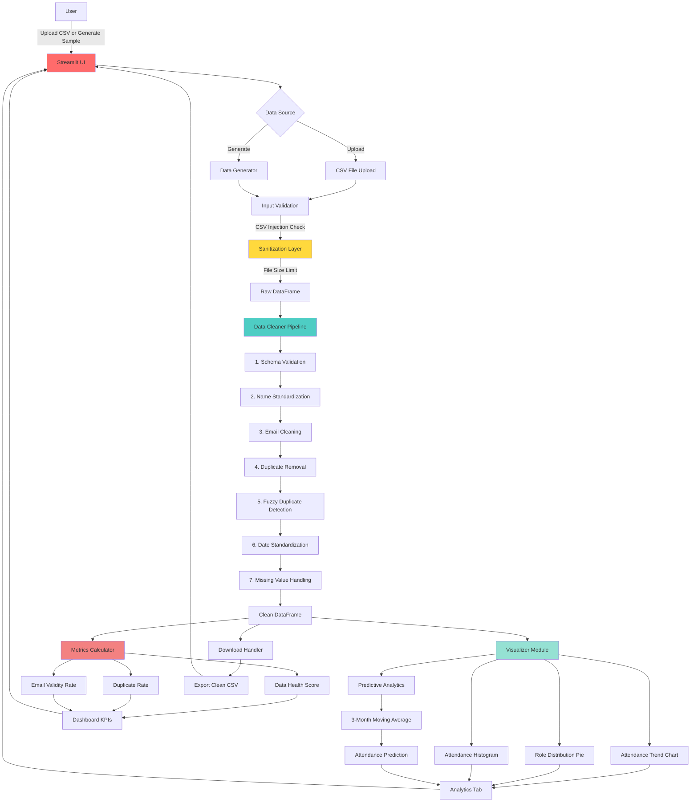

# Architecture Diagram

## System Overview

The Community Pulse application follows a modular, layered architecture designed for maintainability and scalability.



## Component Details

### 1. **User Interface Layer (Streamlit)**
- **Technology:** Streamlit
- **Responsibilities:**
  - Render interactive dashboard
  - Handle file uploads
  - Display KPI metrics
  - Provide data download functionality
  - Manage session state

### 2. **Data Input Layer**
- **Components:**
  - **CSV Upload Handler:** Accepts user-uploaded CSV files
  - **Data Generator:** Creates synthetic messy data for demonstration
- **Security Features:**
  - File size validation (max 50MB)
  - CSV injection detection and sanitization
  - File type validation (.csv only)

### 3. **Data Cleaning Pipeline**
- **Location:** `utils/cleaner.py`
- **Steps:**
  1. **Schema Validation:** Ensures required columns exist
  2. **Name Standardization:** Converts to Title Case
  3. **Email Cleaning:** Validates and fixes email formats
  4. **Duplicate Removal:** Exact match on email addresses
  5. **Fuzzy Duplicate Detection:** Uses Levenshtein distance (85% threshold)
  6. **Date Standardization:** Parses multiple formats, detects future dates
  7. **Missing Value Handling:** Imputes with zeros or mode

### 4. **Metrics & Analytics Layer**
- **Data Health Score Calculator:**
  - Formula: `100 - (duplicate_rate + invalid_email_rate + missing_rate)`
  - Tracks quality improvements
- **Predictive Analytics:**
  - 3-month moving average calculation
  - Percentage change prediction for next period

### 5. **Visualization Layer**
- **Location:** `utils/visualizer.py`
- **Charts:**
  - **Attendance Trend:** Time-series line chart
  - **Role Distribution:** Pie chart
  - **Attendance Histogram:** Frequency distribution
- **Technology:** Plotly Express & Graph Objects

### 6. **Configuration Management**
- **Location:** `config.py`
- **Purpose:** Centralized configuration for:
  - Magic numbers (thresholds, rates)
  - File paths
  - KPI targets
  - Logging settings

## Data Flow

1. **Input Phase:**
   ```
   User Input → Validation → Sanitization → Raw DataFrame
   ```

2. **Cleaning Phase:**
   ```
   Raw DataFrame → Cleaning Pipeline → Clean DataFrame + Metrics
   ```

3. **Analysis Phase:**
   ```
   Clean DataFrame → Visualizations + Predictions
   ```

4. **Output Phase:**
   ```
   Results → Dashboard Display + CSV Download
   ```

## Error Handling Strategy

- **Input Validation:** Schema checks before processing
- **Graceful Degradation:** Empty figures returned for missing data
- **Logging:** Python logging module tracks all operations
- **User Feedback:** Toast notifications for errors and success

## Scalability Considerations

### Current State (Phase 1)
- **Records:** Up to 10,000
- **Storage:** CSV files
- **Users:** Single user

### Future Enhancements (Phase 2)
- **Database Integration:** PostgreSQL for persistent storage
- **Authentication:** Role-based access control
- **API Layer:** RESTful endpoints for integrations
- **Caching:** Redis for frequently-accessed data

## Technology Stack

| Layer | Technology | Purpose |
|-------|-----------|---------|
| Frontend | Streamlit | Interactive web interface |
| Data Processing | Pandas, NumPy | Data manipulation |
| Visualization | Plotly | Interactive charts |
| Fuzzy Matching | python-Levenshtein | Near-duplicate detection |
| Testing | pytest | Unit and integration tests |
| CI/CD | GitHub Actions | Automated testing |
| Logging | Python logging | Application monitoring |

## Security Features

1. **CSV Injection Protection:** Strips dangerous formula prefixes
2. **File Size Limits:** Prevents resource exhaustion
3. **Input Validation:** Schema and type checking
4. **Error Boundaries:** Try-catch blocks prevent crashes

## Performance Optimizations

- **Vectorized Operations:** Pandas for batch processing
- **Lazy Evaluation:** Charts generated only when tab is active
- **Session State:** Cached cleaned data to avoid reprocessing
- **Efficient Algorithms:** O(n log n) sorting for duplicate detection
